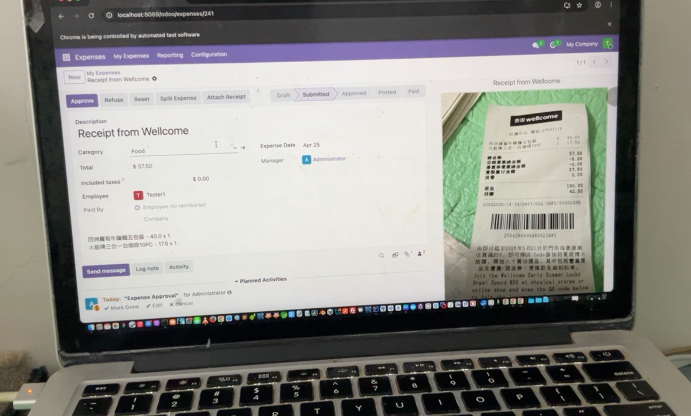
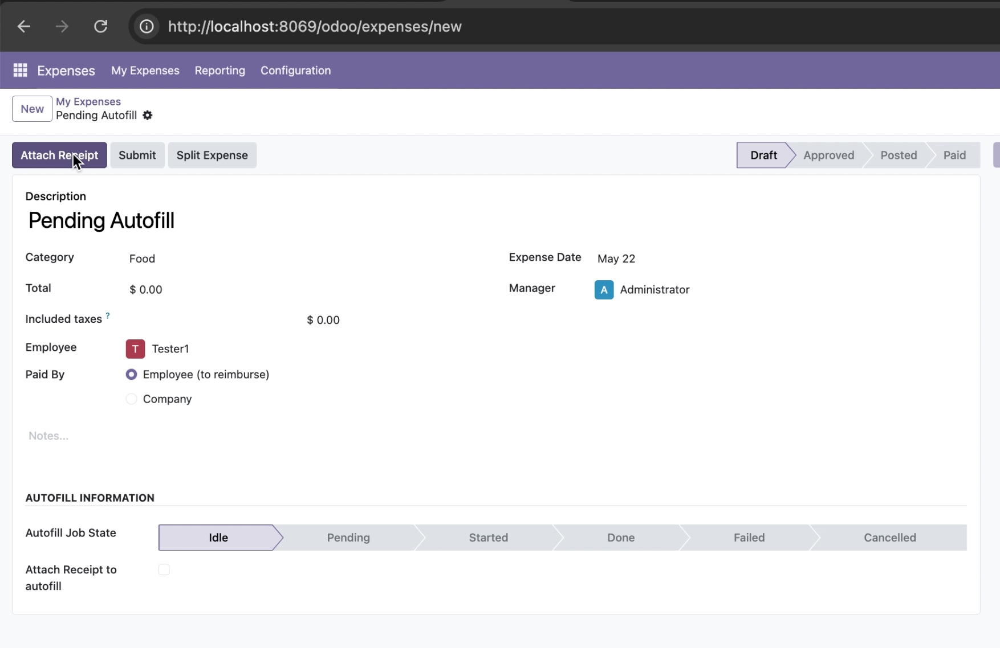
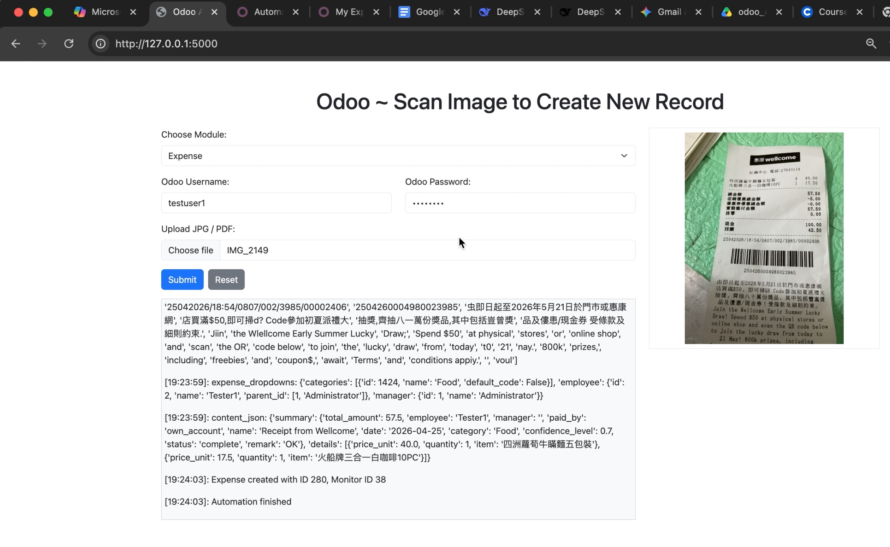
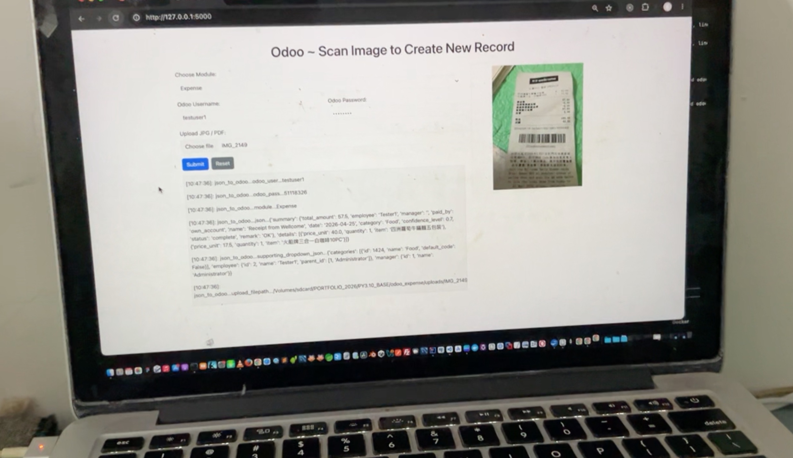
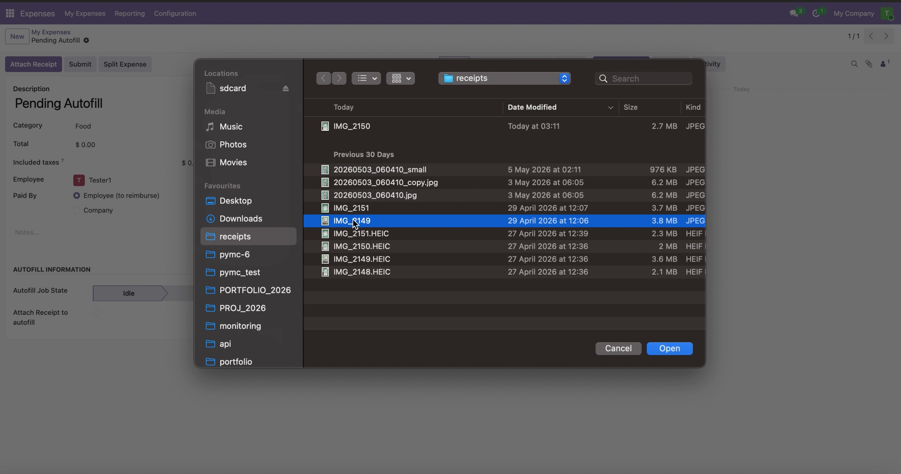
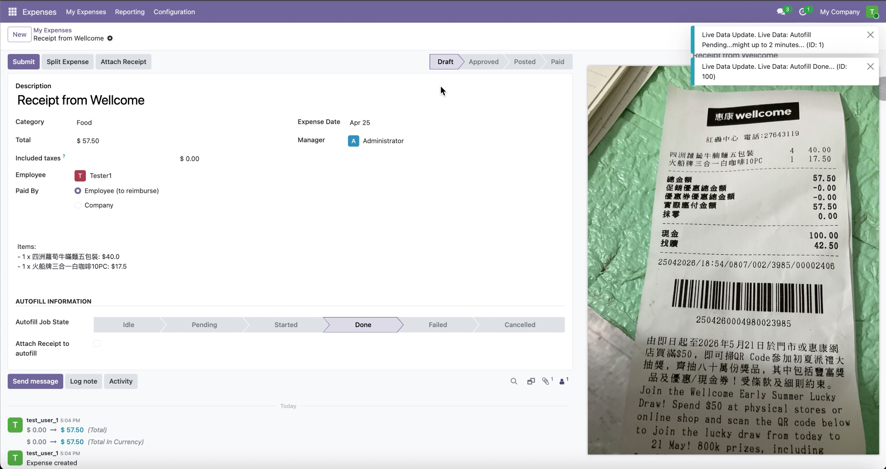
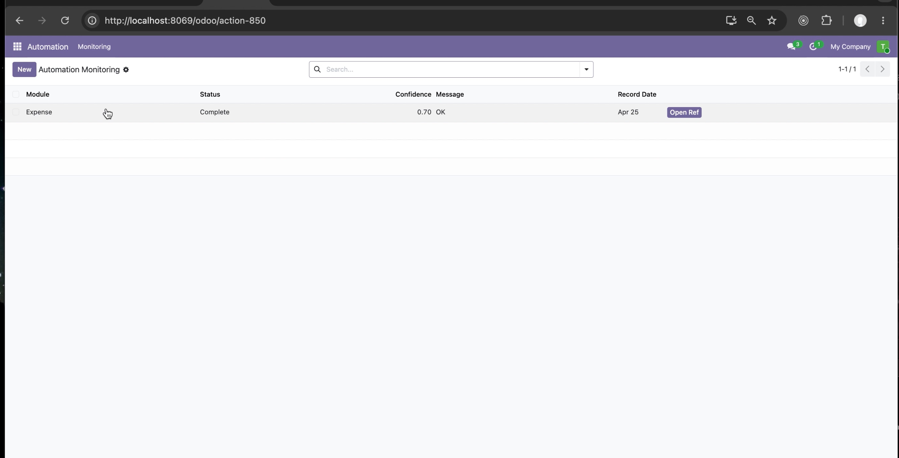
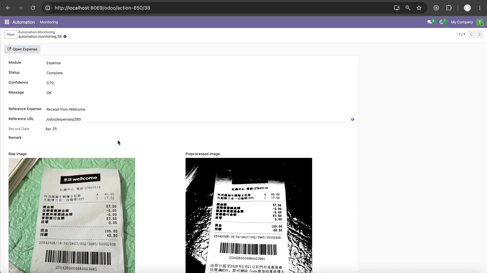
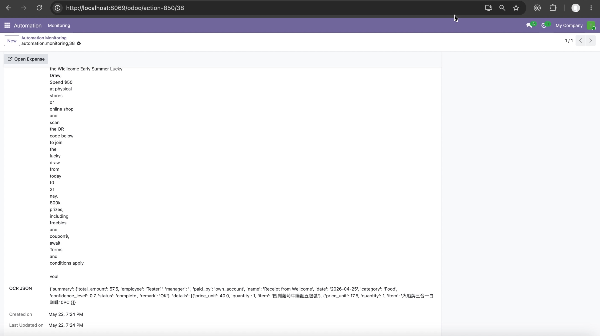

## Portfolio Project: automate receipt to ODOO expense records

> ### Introduction: 

- This project automates expense entry into Odoo ERP using OCR and LLM parsing.

> ### Key pipeline steps:

- upload receipt image  

- extract OCR texts from receipt image, 

- LLM extract expense information from OCR texts into OCR JSON,

- Auto-Create both Odoo Expense Record And Automation Record from OCR JSON,

- staff regularly review automation status of each auto-created odoo expense, and fix it when needed.


> ### Business Benefit

Manual expense entry is slow, error‑prone, and frustrating for employees.  
This project eliminates repetitive data entry by automatically reading receipts, parsing them into structured data, and inserting them directly into Odoo ERP.  

Result: faster reimbursements, fewer mistakes, and saved time.


> ### Three Iterations of Expense Automation:

> ### 1. Selenium UI Automation

- Approach: upload receipt image, and selenium will drive Odoo’s web interface, filling expense forms and uploading receipts automatically.

[](https://youtu.be/Xd6Jz8SfZVY)

- Pros:
  - High traceability: users can visually see what the automation is doing.
  - Easy to debug when something goes wrong (selectors, fields).

- Cons:
  - Fragile: UI changes break selectors.
  - Slower and resource‑heavy (browser automation).
  - Requires user to wait and watch the automation run.


> ### 2. Odoo Expense Button Extension

- Approach: Inherit Odoo’s [ Attach Receipt ] button, add logic to call EasyOCR + LLM, then parse text into JSON that matches `hr.expense` fields.

[](https://youtu.be/PlU3FX94n9M)

- Pros:
  - Seamless integration with existing Odoo workflow.
  - Users remain in control: they can adjust parsed data before saving.
  - Itegrated with Odoo’s UI, no external steps needed.

- Cons:
  - Requires custom Odoo module development.
  - Slightly higher maintenance when upgrading Odoo versions.
  - Still depends on user interaction (semi‑automated).


> ### 3. XML‑RPC Direct Insertion

- Approach: upload receipt image, and XML‑RPC API direct calls to insert expense record to odoo in the background.

[](https://youtu.be/DMegoO_GpFw)

- Pros:
  - users occasionally review automation records instead of watching every run.
  - Fast, lightweight, no browser overhead.
  - Scales better for batch automation.

- Cons:
  - No visual traceability: users cannot see each record being filled.
  - Risk of silent mistakes if not reviewed.
   

---

> ## github repo

### - python flask: 

after received receipt image from anywhere (in our demo, we use web upload but it can be from any source), it will pass to python flask for processing the pipeline all the way from image -> OCR text -> LLM extracting receipt information -> auto-creating expense records in ODOO backend.

[https://github.com/cshwk2020/odoo_expense](https://github.com/cshwk2020/odoo_expense)

- config.py : all important key configuration such as LLM ApiKey, odoo admin and password, etc.

- app.py : webserver entry point for workflow (1) upload receipt image -> OCR -> LLM -> selenium -> ODOO expense + automation record. 

- ms.py : microservice of python flask for workflow (2) inherit odoo expense [ attach receipt ] button -> OCR -> LLM -> auto fill expense form. 

- automation.py : entry point for workflow (3) upload receipt image -> OCR -> LLM -> xmlrpc --> ODOO expense + automation record. 

- ocr_utils : extract OCR text from uploaded receipt image.

- ai_utils.py : LLM extract receipt information from OCR text into JSON.

- odoo_utils : higher level odoo API such as create odoo hr_expense record.

- odoo_xmlrpc.py : lower level remote call to odoo backend, such as get expense categories, etc, that help fulfill API in odoo_utils.

- vault_utils.py : security hvac utils to get sensitive information such as LLM ApiKey and password from vault instead of hardcode in source code.

- test/* : unit testing by pytest -s
  

### - ODOO module : automation_dashboard 
    
beside microservice, there is a ODOO module for staff to monitoring the automated expense processing status, and manual edit and fix the expense form when LLM has difficulty handling ambigous OCR text from vague receipt images.

[https://github.com/cshwk2020/odoo/tree/19.0/addons/automation_dashboard](https://github.com/cshwk2020/odoo/tree/19.0/addons/automation_dashboard)

- model/automation_monitoring.py : keep track of status for auto-creating expense record, and FK from automation_dashboard to hr_expense record. 

- views/automation_monitoring_views.xml : list view and form view for automation_dashboard records.


### - ODOO module : hr_expense_autofill 
    
new module for workflow (2) inherit expense [ attach receipt ] button to addon logic to autofill expense form, there is a ODOO module for staff to monitoring the automated expense processing status.

[https://github.com/cshwk2020/odoo/tree/19.0/addons/hr_expense_autofill](https://github.com/cshwk2020/odoo/tree/19.0/addons/hr_expense_autofill)

- model/hr_expense_autofill.py : inherit model of hr.expense, to override attach_document to add on additional OCR logic and LLM extract receipt information, which then auto fill the expense form. 

- views/hr_expense_autofill_views.xml : list view and form view for inherited hr.expense records. it also display fields such as autofill_job_state and autofill_in_progress, so user see what is backend status while waiting for OCR and LLM processing.

- static/src/js : owl js related to receive notification from python backend via channel, even before python method returning from function call. It is needed because python server call might need update processing status on frontend several times during a single method call.


### - ODOO module : hr_expense_automate
    
new module for methods that need affect both hr_expense and automation_dashboard. Adding such method to either hr_expense or automation_dashboard module seem not right, so additional module was added when it need affect multiple module models at once.

[https://github.com/cshwk2020/odoo/tree/19.0/addons/hr_expense_automate](https://github.com/cshwk2020/odoo/tree/19.0/addons/hr_expense_automate)

- model/hr_expense_automate.py : methods to affect both hr_expense and automation_dashboard module models. 

---

> ## workflow illustration with screenshots and simplfied code snippets

for full source code, please reference in our github repo. 

Here we simplfied code snippets by trimming away some details for improved readbility on core logic.


> ### workflow (1) Selenium UI Automation: upload receipt image -> OCR -> LLM -> selenium -> ODOO 

> ### upload receipt image 



### - app.py, /automation start processing

```
@app.route("/automation", methods=['POST'])
def automation_upload():
    module = request.form.get("module")
    odoo_user = request.form["odooUser"]
    odoo_pass = request.form["odooPass"]
    file = request.files['receipt']
    .......
    threading.Thread(target=run_job, args=(abs_filepath, module, odoo_user, odoo_pass)).start()
    .......


def run_job(filepath, module, odoo_user, odoo_pass):
    gray_image_np, texts = run_easyocr_file(filepath)
    expense_dropdowns = fetch_expense_dropdowns(ODOO_BASE_URL, ODOO_DB, odoo_user, odoo_pass)
    ......
   
```


> ### selenium auto fill expense form while human watching
 

  

### - app.py, json_to_odoo selenium processing

```
def run_job(filepath, module, odoo_user, odoo_pass):
    ......
    odoo_result = json_to_odoo(odoo_user, odoo_pass, module, content_json, expense_dropdowns, filepath)


def json_to_odoo(odoo_user, odoo_pass, module, json, supporting_dropdown_json, upload_filepath): 

    global DUPLICATE_RECEIPT_ERR_TEXT
    global SELENIUM_GOOGLE_CHROME_BINARY, SELENIUM_GOOGLE_CHROME_DRIVER
    global ODOO_BASE_URL, ODOO_LOGON_URL, ODOO_DB
  
    options = Options()
    options.binary_location = SELENIUM_GOOGLE_CHROME_BINARY

    service = Service(SELENIUM_GOOGLE_CHROME_DRIVER)
    driver = webdriver.Chrome(service=service, options=options)
    driver.maximize_window()


    ################################
    # ODOO LOGON section

    driver.get(ODOO_LOGON_URL)

    form_inputs = driver.find_elements(By.CSS_SELECTOR, 'form[action="/web/login"] input')
    debugText("Form inputs found:")
    for inp in form_inputs:
        debugText(f"  - {inp.get_attribute('name')} = {inp.get_attribute('value')} (type: {inp.get_attribute('type')})")

    WebDriverWait(driver, 10).until(
        EC.visibility_of_element_located((By.NAME, "login"))
    ).send_keys(odoo_user)

    WebDriverWait(driver, 10).until(
        EC.visibility_of_element_located((By.NAME, "password"))
    ).send_keys(odoo_pass)

    WebDriverWait(driver, 10).until(
        lambda d: d.find_element(By.XPATH, "//button[@type='submit']").is_enabled()
    )

    csrf_token = driver.find_element(By.NAME, 'csrf_token').get_attribute('value')

    db_name = driver.find_element(By.NAME, 'db').get_attribute('value') if driver.find_elements(By.NAME, 'db') else 'default'
    form = driver.find_element(By.CSS_SELECTOR, 'form[action="/web/login"]')

    form.submit()  # This is the key - it preserves all hidden fields


    WebDriverWait(driver, 10).until(
        lambda d: d.get_cookie('session_id') is not None
    )

    #
    next_url = ODOO_MODULES[module]
    driver.get(next_url)


    ################################
    # hr expense form section

    WebDriverWait(driver, 10).until(
        EC.element_to_be_clickable((By.XPATH, "//button[contains(text(),'New')]"))
    ).click()

    #
    categories = supporting_dropdown_json["categories"]
    employee = supporting_dropdown_json["employee"]
    manager = supporting_dropdown_json["manager"]
    summary_json = json["summary"]
    details_json = json["details"]
    description = summary_json["name"]
    category = summary_json["category"]
    total_amount = summary_json["total_amount"]
    employee_name = employee["name"]
    manager_name = manager["name"]

    expense_date = summary_json["date"]
    dt = datetime.strptime(expense_date, "%Y-%m-%d")
    expense_date_ui = dt.strftime("%m/%d/%Y")

    notes_text = "\n".join(
        f"{d['item']} - {d['price_unit']} x {d['quantity']}"
        for d in details_json
    )

    simple_textfield_sevalue(driver, "name_0", description)

    simple_dropdown_setvalue(driver, "product_id_0", category)
   
    simple_textfield_sevalue(driver, "total_amount_currency_0", total_amount)
    
    complex_dropdown_setvalue(driver, "employee_id_0", employee_name)

    # avoid default auto input taxes
    delete_icons = driver.find_elements(By.XPATH, "//div[@name='tax_ids']//i[contains(@class,'oi-close')]")
    for icon in delete_icons:
        driver.execute_script("arguments[0].click();", icon)

    #
    date_mmddyyyy_setvalue(driver, "date_0", expense_date_ui)

    notes_input = WebDriverWait(driver, 10).until(
        EC.element_to_be_clickable((By.ID, "description_0"))
    )
    notes_input.clear()
    notes_input.send_keys(notes_text)

    #
    attach_receipt(driver, upload_filepath)
 
    # capture screenshot for store in automation_dashboard for staff to follow up  
    timestamp = datetime.now().strftime("%Y%m%d_%H%M%S")
    unique_id = str(uuid.uuid4())
    filename = f"odoo_screenshots/expense_{timestamp}_{unique_id}.png"
     
    submit_btn = driver.find_element(By.XPATH, "//button[@name='action_submit']")
    submit_btn.click()


    # Wait for redirect back to list view
    WebDriverWait(driver, 10).until(EC.url_contains("/expenses"))
    driver.get("http://localhost:8069/odoo/expenses")
    # driver.quit()
 
```

---

> ### workflow (2) Inherit Odoo Expense [ Attach Receipt ] Button:

> ### Click Attach Receipt Button to run additional logic of OCR and LLM processing


> ### Browse for receipt image to attach to ODOO expense form



> ### Waiting for OCR and LLM processing to complete in backend

### - ms.py, [ attach_document ] processing

```
def attach_document(self, **kwargs):
        res = super().attach_document(**kwargs)
        attachment_ids = kwargs.get('attachment_ids', [])
        if attachment_ids:
            attachment = self.env['ir.attachment'].browse(attachment_ids[-1])
            if attachment.mimetype and attachment.mimetype.startswith("image"):
                self._message_set_main_attachment_id(attachment, force=True)
                # Update progress BEFORE API call
                self.write({
                    "progress_log": "Autofill running… please wait (up to 2 minutes)",
                    "autofill_in_progress": True,
                    "autofill_job_state": "started",
                })
            # Get the base64 data from attachment
            image_b64 = attachment.datas

            # If it's bytes, decode to string
            if isinstance(image_b64, bytes):
                image_b64 = image_b64.decode('utf-8')

            # Remove any existing prefix
            if ',' in image_b64:
                image_b64 = image_b64.split(',')[1]

            # Add the proper Data URL prefix
            mimetype = attachment.mimetype or 'image/jpeg'
            image_data_url = f"data:{mimetype};base64,{image_b64}"
 
            live_data = {'id': 1, 'name': 'Autofill Pending...might up to 2 minutes...'}
            self._send_bus_notification(live_data)
            
            #
            self.process_autofill_with_image(image_data_url)
          
            #
            live_data = {'id': 100, 'name': 'Autofill Done...'}
            self._send_bus_notification(live_data)
           
        return {'type': 'ir.actions.client', 'tag': 'reload'}


    #  
    def process_autofill_with_image(self, image_b64):

        self.ensure_one()

        try:
            self.write({
                "progress_log": "Processing receipt...",
                "autofill_job_state": "pending",
                "autofill_in_progress": True,
            })

            expense_dropdowns = self._fetch_expense_dropdowns()

            resp = requests.post(
                IMAGE2JSON_URL,
                json={
                    "expense_dropdowns": expense_dropdowns,
                    "module": "expense",
                    "receipt_image": image_b64,
                    "expense_id": self.id
                },
                timeout=3
            )
 

        except requests.exceptions.Timeout:

            #
            live_data = {'id': -10, 'name': f'Autofill API Timeout...'}
            self._send_bus_notification(live_data)
             
            self.write({
                "progress_log": "Autofill timed out.",
                "autofill_job_state": "failed",
                "autofill_in_progress": False,
            })


        except Exception as e:

            self.write({
                "progress_log": f"Error: {str(e)}",
                "autofill_job_state": "failed",
                "autofill_in_progress": False,
            })
 

        if resp.status_code != 200:
             
            self.write({
                "progress_log": f"API error: {resp.text}",
                "autofill_job_state": "failed",
                "autofill_in_progress": False,
            })

            #
            live_data = {'id': -20, 'name': f'Autofill Error...{resp.text}...'}
            self._send_bus_notification(live_data)
             
        else:

            data = resp.json().get('data', {})
        
            notes = data.get("summary", {}).get("notes", "")
 
            if data.get("details"):
                notes += "\n\nItems:\n"
                for item in data.get("details", []):
                    notes += f"- {item.get('quantity', 1)} x {item.get('item', 'Item')}: ${item.get('price_unit', 0)}\n"
 
            update_vals = {
                "name": data.get("summary", {}).get("name", "Expense"),
                "total_amount": data.get("summary", {}).get("total_amount", 0.0),
                "date": data.get("summary", {}).get("date"),
                "payment_mode": data.get("summary", {}).get("paid_by", "own_account"),
                "description": notes,
                "progress_log": "Autofill complete!",
                "autofill_job_state": "done",
                "autofill_in_progress": False
            }
             
            update_vals = {k: v for k, v in update_vals.items() if v is not None}
            self.write(update_vals)

```

> After OCR and LLM finished, output was used to auto-fill expense form




---

> ### workflow (3) : upload receipt image -> OCR -> LLM -> xmlrpc -> ODOO 

> ### upload image to flask, and it all the way finished to create expense record in backend.


### - automation.py, xmlrpc processing pipeline

```
@app.route("/automation", methods=['POST'])
def automation_upload():
    module = request.form.get("module")
    odoo_user = request.form["odooUser"]
    odoo_pass = request.form["odooPass"]

    file = request.files['receipt']
    ......
    
    threading.Thread(target=run_job, args=(abs_filepath, module, odoo_user, odoo_pass)).start()


def run_job(filepath, module, odoo_user, odoo_pass):

    try:
        
        # Step 1: OCR
        gray_image, texts = run_easyocr_file(filepath)
        ocr_text = "\n".join(texts)
          
        # Step 2: Dropdowns
        expense_dropdowns = fetch_expense_dropdowns(ODOO_BASE_URL, ODOO_DB, odoo_user, odoo_pass)
         
        # Step 3: AI convert OCR → JSON
        content_json = run_ai_convert_text_to_json(ocr_text, expense_dropdowns)
 
        # Step 4: Prepare expense + monitor values
        with open(filepath, "rb") as f:
            image_bytes = f.read()

        receipt_image_b64 = base64.b64encode(image_bytes).decode("utf-8")

        # 灰階圖轉 base64
        try:
            import cv2
            _, buf = cv2.imencode(".png", gray_image)
            gray_image_b64 = base64.b64encode(buf).decode("utf-8")
        except Exception:
            gray_image_b64 = None

        summary = content_json.get("summary", {})
        expense_vals = {
            "automation_monitor": True,
            "name": summary.get("name"),
            "total_amount": summary.get("total_amount"),
            "date": summary.get("date"),
            "payment_mode": summary.get("paid_by"),
            "description": summary.get("remark"),
        }
        expense_vals = {k: v for k, v in expense_vals.items() if v is not None}

        # normalize module value to lowercase
        module_value = str(module).lower() if module else "expense"

        monitor_vals = {
            "module": module_value,
            "raw_image": receipt_image_b64,
            "preocr_image": gray_image_b64,
            "ocr_text": ocr_text,
            "ocr_json": content_json,
            "status": summary.get("status"),
            "confidence": summary.get("confidence_level"),
            "message": summary.get("remark"),
            "image_hash": hashlib.sha256(image_bytes).hexdigest(),
        }
        monitor_vals = {k: v for k, v in monitor_vals.items() if v is not None}

        # Step 5: Call Odoo XML-RPC custom method
        uid, models = get_models(ODOO_BASE_URL, ODOO_DB, odoo_user, odoo_pass)
        expense_id, monitor_id = models.execute_kw(
            ODOO_DB, uid, odoo_pass,
            "hr.expense", "create_with_monitor",
            [expense_vals, monitor_vals]
        )
 
    except Exception as e:
         ......

     
```

> ### regularly, staff go to automation_dashboard listing to monitor status of each receipt image processing.



> ### detail information for each receipt processing for staff to follow up.






